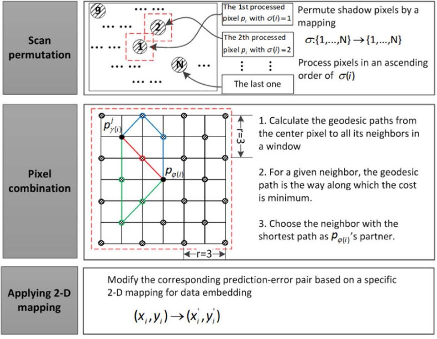
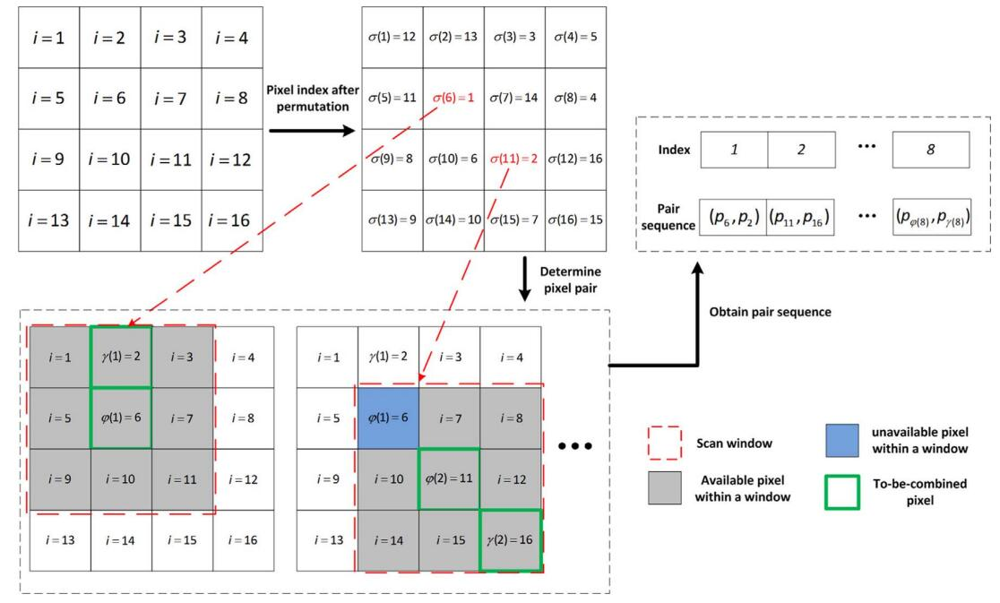
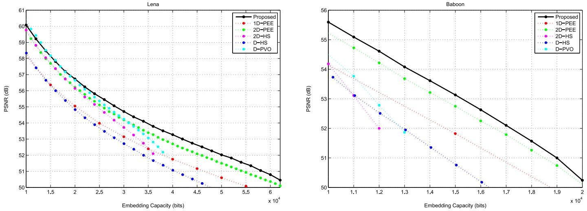
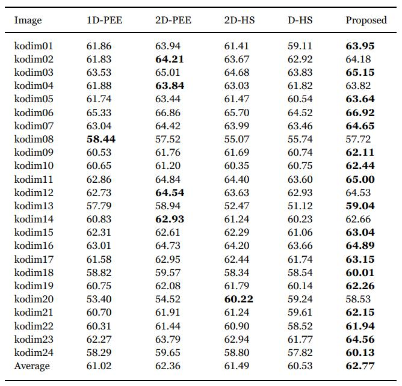

Geodesic path pairwise PEE
=======


This repo is implementation for the accepted paper "[High-fidelity reversible data hiding based on geodesic path and pairwise prediction-error expansion](https://www.sciencedirect.com/science/article/pii/S0925231216313832)" (Neurocomputing 2017).


<p align="center">     </p>
<p align="center"> Figure 1: The overview of embedding process. </p>


<p align="center">     </p>
<p align="center"> Figure 2: Construction of pair sequence.</p>


## How to run

```
go to code
Follow ReadMe.tex
```

## Experimental Results

<p align="center">     </p>
<p align="center"> Figure 3: Performance evaluation in terms of capacity-distortion </p>

<p align="center">     </p>
<p align="center"> Figure 4: erformance comparison on Kodak image database for a capacity of 10,000 bits.</p>


## Environment
Matlab 2016b <br>


## Acknowledgement
This work is supported by the National Science Foundation of China (Nos. 61502160, 61572052, 61272421, 61370225 and 61572182), the PAPD fund, and the CICAEET fund.


## Citation
If you find this work useful for your research, please cite
```
@article{OU201723,
title = {High-fidelity reversible data hiding based on geodesic path and pairwise prediction-error expansion},
journal = {Neurocomputing},
volume = {226},
pages = {23-34},
year = {2017},
doi = {https://doi.org/10.1016/j.neucom.2016.11.017},
author = {Bo Ou and Xiaolong Li and Jinwei Wang and Fei Peng},
}
```

## License and Copyright
The project is open source under MIT license (see the ``` LICENSE ``` file).

